# TelegramBot
В данном репозитории представлен проект телеграмм бота с возможностью нейросетевой обработки изображений.

    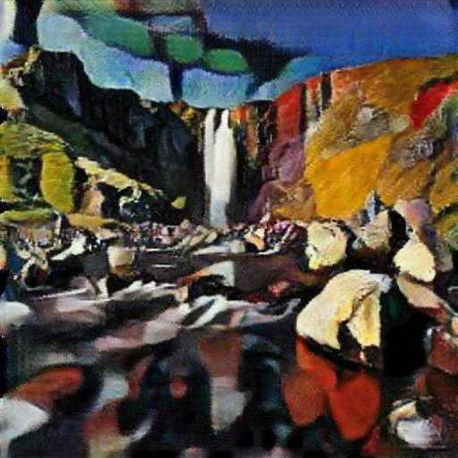
    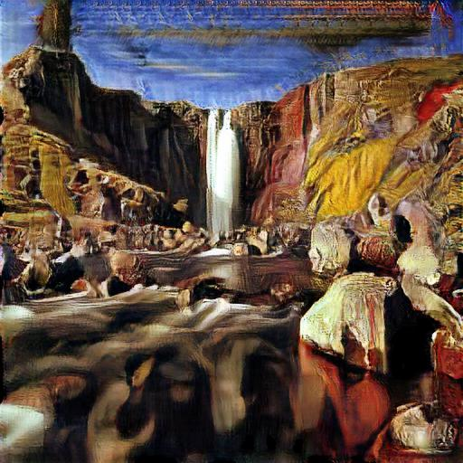
    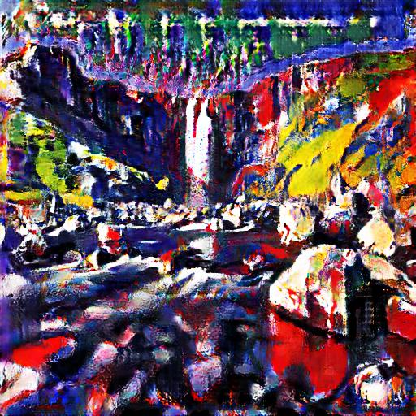

 

## Overview

Основные возможности бота:
* Neural Style Transfer - передача стиля одного изображения на второе.
* Быстрое нанесение стиля на изображение с помощью CycleGan. Доступны три стиля: кубизм, экспресионизм, ранний ренесанс.
* Super resolution - повышение разрешения изображения с помощью ESRGAN.

Код бота выполнен на асинхронном фреймворке aiogram. В качестве фреймворка глубокого обучения используется PyTorch.

Бот имеет простой интерфейс и все необходимые подсказки для того, чтобы пользователь не запутался при использовании.
## Training CycleGAN
В качестве CycleGan взята собственная реализация с Unet в качестве генератора. Код тренировки доступен в файле train.ipynb.

Изображения для каждого из трех стилей были взяты из соревнования [Painter by Numbers](https://www.kaggle.com/c/painter-by-numbers/data).
Это соревнование содержит большое количество изображений различных стиле собраных в основном с сайта [WikiArt.org](https://www.wikiart.org/).
Фотографии второго множества из датасета ukiyoe2photo, плюс дополнительно собрано 1500 картинок с людьми из яндекс-картинок,
так как изначально датасет содержит в основном изображения природы.

Пример тестирования генераторов на "идентичность" и "повторимость" для кубизма показаны ниже.

    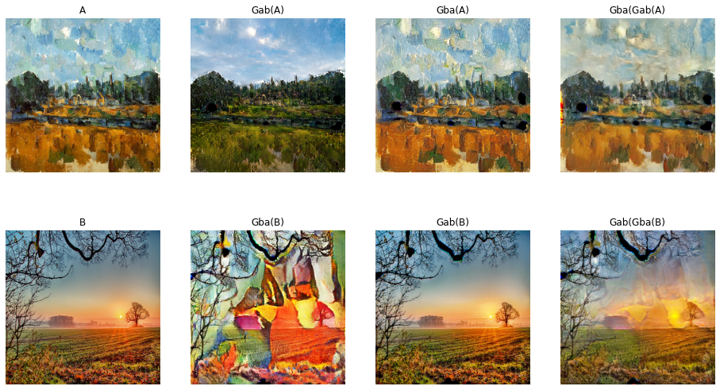

Пример работы генераторов всех трех стилей:

    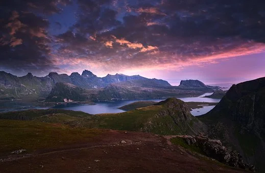
     
    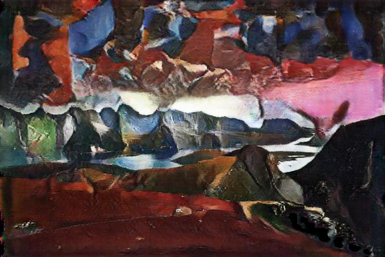
    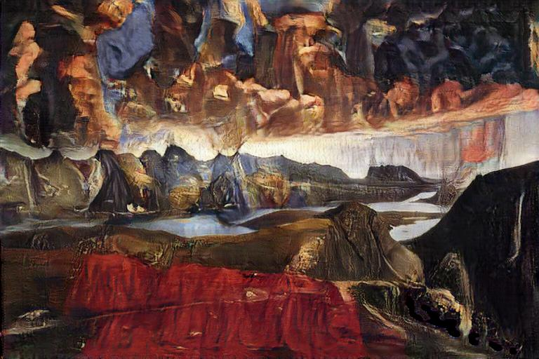
    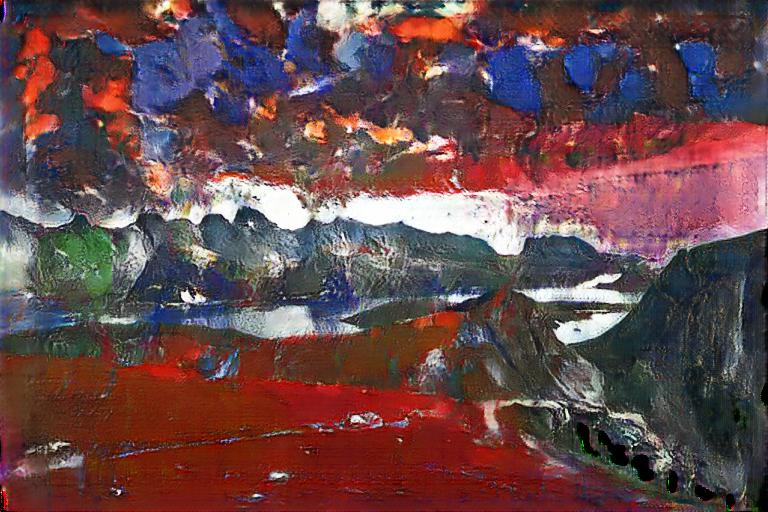

## Neural Style Transfer

Перенос стиля основан на медленном итерационном алгоритме переноса стиля, с той лишь разницей, что добавлена потеря общей дисперсии. Эта потеря позволяет минимизировать
уровень шума в изображении. Для вычисления величины шума используется среднеквадратичная ошибка между
исходным изображение и изображением сдвинутым вправо на 1 пиксель. Для равновесия вычисляется
та же процедура для изображения сдвинутого вниз 1 пиксель. Общая потеря находится как сума двух
этих величин.

Пример работы:

    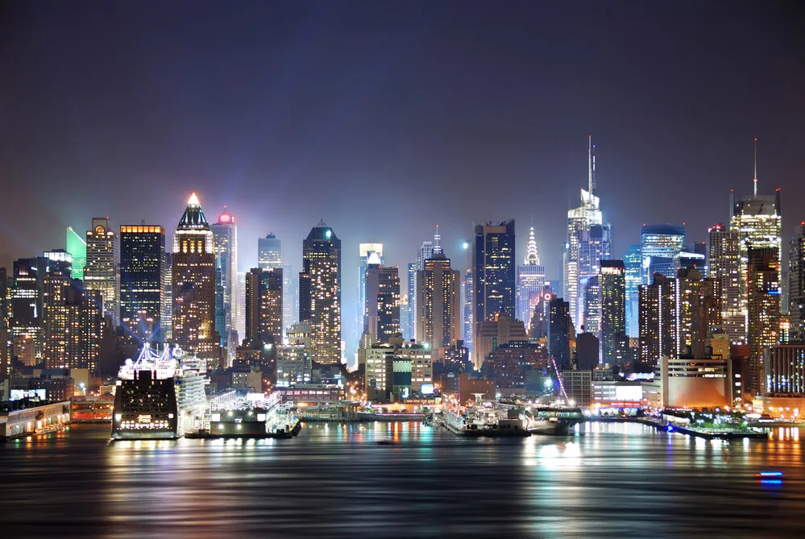
    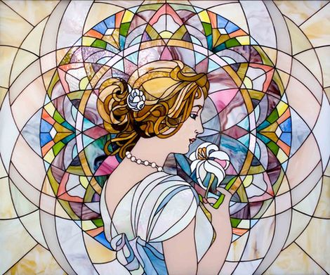
     
    Результат после 100 итераций
     
    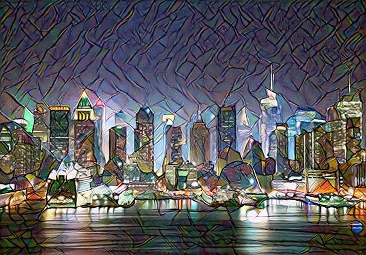

## ESRGAN
Реализация ESRGAN взята из [этого репозитория](https://github.com/xinntao/ESRGAN?ref=dtf.ru).
В качестве предобработки добавленно сжатие изображения до разрешения HD, это мера
необходима, потому что обработка изображений в full HD может занять весьма длительное время.
Сжатие до HD и обработка ESRGAN дает изображение с большим разрешением чем full HD, что так или иначе выгодней 
для конечного пользователя, чем отказ от обработки из-за слишком большого начального разрешения.

## Weights

Веса для каждой из моделей доступны на моем [гугл диске.](https://drive.google.com/drive/folders/141ra42i_VTdz3hLtIT9z9_iCG5zB0ZZc?usp=sharing)
